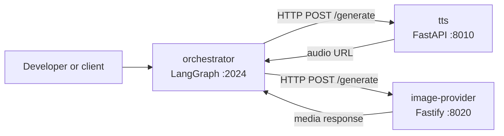

# AI Series Monorepo

AI Series generates short-form educational videos from a topic. The LangGraph
orchestrator researches a topic, plans and writes a script, creates visual and
narration assets, generates scene-bounded subtitles, validates the resulting
media, and prepares publishing metadata.

This repository contains four independently runnable applications. They keep
separate runtimes and communicate over HTTP. Local development runs Python
services natively so Apple Silicon machines can use PyTorch MPS.

## Architecture



`orchestrator` is the only application that coordinates the workflow. It calls
`tts` and `image-provider` over HTTP. `transcriber` remains independently
available, but production narration does not invoke it.

```text
TTS_URL=http://localhost:8010
IMAGE_PROVIDER_URL=http://localhost:8020
```

Supporting services do not call each other. Each can be started, tested, and
developed independently. Service URLs are read by the orchestrator from its
environment, so local ports can be changed without changing provider code.

## Repository Structure

```text
.
├── apps/
│   ├── orchestrator/       # LangGraph workflow and HTTP provider clients
│   ├── tts/                # Chatterbox text-to-speech service
│   ├── image-provider/     # Gemini browser automation and HTTP API
│   └── transcriber/        # WhisperX alignment and transcription service
├── scripts/
│   └── setup-python.sh     # Python venv and dependency setup
├── .env.example            # Environment variable catalog
├── .github/                # Actions workflows and Dependabot config
├── package.json            # Root commands and process orchestration
├── pnpm-lock.yaml          # Workspace lockfile
├── pnpm-workspace.yaml     # JavaScript workspace members
└── README.md
```

Only `apps/orchestrator` and `apps/image-provider` are pnpm workspace members.
`tts` and `transcriber` keep isolated Python virtual environments and are
started by root pnpm commands.

## Services

| Service | Responsibility | Runtime and framework | Port | Start command | Important constraints |
| --- | --- | --- | ---: | --- | --- |
| `orchestrator` | Runs the video-generation graph and calls providers | TypeScript, LangGraph | `2024` | `pnpm dev:orchestrator` | Uses LangGraph dev server; real LLM calls require `OPENROUTER_API_KEY` |
| `tts` | Converts narration text to WAV audio | Python 3.11, FastAPI, PyTorch, Chatterbox | `8010` | `pnpm dev:tts` | Chatterbox model loads during startup; `DEVICE` defaults to `mps` |
| `image-provider` | Generates image or video assets through Gemini web automation | Node.js, TypeScript, Fastify, Playwright | `8020` | `pnpm dev:image-provider` | Requires Google authentication; browser starts lazily on uncached generation |
| `transcriber` | Produces word-level alignment and transcription timestamps | Python 3.11, FastAPI, WhisperX, PyTorch | `8030` | `pnpm dev:transcriber` | Alignment model loads at startup when language is configured; ASR loads lazily and runs on CPU |

The orchestrator's LangGraph configuration targets Node.js 20. The root CI
tests Node.js 20 and 22. The image provider itself documents Node.js 18+, but
use Node.js 20 or newer for this monorepo.

## Requirements

- Node.js 20 or newer
- pnpm `10.34.3`
- Python `3.11`, available as `python3.11`
- macOS is recommended for the configured MPS development path
- Apple Silicon and a PyTorch build with MPS support for GPU acceleration
- Chromium, installed automatically by the image provider's pnpm postinstall
- Google account access for Gemini generation
- `ffmpeg` and `ffprobe` for media composition and the transcriber smoke test
- macOS `say` for generating the transcriber smoke-test sample

`pnpm install` installs JavaScript dependencies and runs the image provider's
Chromium installation hook. A custom browser can be selected with
`BROWSER_EXECUTABLE_PATH`.

## Quick Start

Clone the repository and enter its root:

```bash
cd ai-series
```

Run complete setup:

```bash
pnpm run setup:all
```

`setup:all` runs `pnpm install`, creates `apps/tts/venv` and
`apps/transcriber/venv` with Python 3.11, installs their requirements, and
creates missing per-service `.env` files from local examples.

Configure the orchestrator before using real providers:

```bash
$EDITOR apps/orchestrator/.env
```

Set a valid `OPENROUTER_API_KEY`. Keep secrets in local `.env` files only.

Start all services:

```bash
pnpm dev
```

Open the LangGraph development API and playground at
`http://localhost:2024`. First requests to TTS, transcriber, or image
generation can take longer while models or browser state initialize.

## Environment Configuration

Each application reads environment values from its own directory:

| File | Loaded by | Purpose |
| --- | --- | --- |
| `apps/orchestrator/.env` | LangGraph CLI and orchestrator config | LLM, provider URLs, feature flags, artifact storage |
| `apps/tts/.env` | `python-dotenv` from the TTS working directory | PyTorch device and output directory |
| `apps/image-provider/.env` | `dotenv` from the image provider working directory | Gemini, browser, timeout, cache, and server settings |
| `apps/transcriber/.env` | Uvicorn `--env-file .env` in the root command | WhisperX model and device settings |

The root `.env.example` is a catalog. The setup script copies each app's
`.env.example`; it does not load one shared root environment file.

### Orchestrator

Important variables in `apps/orchestrator/.env.example`:

| Variable | Meaning |
| --- | --- |
| `OPENROUTER_API_KEY` | Required for real LLM requests |
| `DEFAULT_MODEL` | Fallback model for agents |
| `MODEL_<AGENT>` | Per-agent model override |
| `USE_REAL_PROVIDERS` | Selects real provider clients when `true` |
| `IMAGE_PROVIDER_URL` | Image provider base URL; default `http://localhost:8020` |
| `TTS_URL` | TTS base URL; default `http://localhost:8010` |
| `TRANSCRIBER_URL` | Transcriber base URL; default `http://localhost:8030` |
| `ENABLE_QA` and stage-specific QA flags | Enable graph quality gates |
| `ENABLE_VIDEO_ASSETS` | Enables video asset generation when supported |
| `ARTIFACT_STORE_ENABLED` | Enables persisted run artifacts |
| `ARTIFACT_STORE_DIR` | Artifact directory; default `runs` |
| `NARRATIVE_HOLD_SECONDS` | Final narrative visual hold before outro; default `0.5` |

### TTS

`apps/tts/.env.example` defines:

| Variable | Meaning |
| --- | --- |
| `DEVICE` | PyTorch device; defaults to `mps` |
| `OUTPUT_DIR` | Generated WAV directory; defaults to `outputs` |

### Image Provider

`apps/image-provider/.env.example` defines `GEMINI_URL`,
`BROWSER_HEADLESS`, optional `BROWSER_EXECUTABLE_PATH`, `USER_DATA_DIR`,
`CONCURRENCY`, generation and authentication timeouts, retry settings,
`DOWNLOAD_DIR`, `CACHE_DIR`, `PROMPTS_FILE`, `GENERATION_TYPE`, `LOG_LEVEL`,
and `PORT`. Root setup uses `PORT=8020`.

The persistent Playwright profile is stored under
`apps/image-provider/browser-profile/`. It is ignored by Git and may contain a
Google login session.

### Transcriber

`apps/transcriber/.env.example` defines:

| Variable | Meaning |
| --- | --- |
| `WHISPERX_MODEL` | Whisper model; default `large-v3` |
| `WHISPERX_DEVICE` | `auto`, `mps`, or `cpu`; default `auto` |
| `WHISPERX_COMPUTE_TYPE` | WhisperX compute type; default `int8` |
| `WHISPERX_LANGUAGE` | Alignment language; empty means unset |
| `WHISPERX_FORCE_TRANSCRIBE` | `1` or `true` forces ASR before alignment |

## Running Services

Run the complete local environment:

```bash
pnpm dev
```

Run one application:

```bash
pnpm dev:orchestrator
pnpm dev:image-provider
pnpm dev:tts
pnpm dev:transcriber
```

The root process runner labels logs by service and stops remaining processes
if one service exits. Stop the environment with `Ctrl-C`.

| Service | URL |
| --- | --- |
| Orchestrator LangGraph API and playground | `http://localhost:2024` |
| TTS | `http://localhost:8010` |
| Image provider | `http://localhost:8020` |
| Transcriber | `http://localhost:8030` |

## HTTP Endpoints

### TTS

FastAPI application: `apps/tts/app/main.py`.

| Method | Path | Purpose |
| --- | --- | --- |
| `GET` | `/` | Service health response |
| `POST` | `/generate` | Generate WAV audio from `text` and optional `voice` |
| `GET` | `/audio/{filename}` | Serve generated audio files |

`POST /generate` returns a JSON object containing `status`, `file`, and `url`.
FastAPI also exposes `/docs`, `/redoc`, and `/openapi.json`.

### Image Provider

Fastify application: `apps/image-provider/src/server.ts`.

| Method | Path | Purpose |
| --- | --- | --- |
| `GET` | `/health` | Reports server status, authentication state, and browser state |
| `POST` | `/generate` | Accepts a prompt and optional `image` or `video` type |

Send `Accept: application/json` to receive structured media metadata and
base64 content. Without that header, the first generated asset is returned as
binary media. Invalid request bodies return HTTP 400. No OpenAPI route is
registered by this Fastify service.

### Transcriber

FastAPI application: `apps/transcriber/app/main.py`.

| Method | Path | Purpose |
| --- | --- | --- |
| `GET` | `/health` | Reports model, device, and loading state |
| `POST` | `/align` | Accepts multipart audio and optional transcript text |

`POST /align` expects multipart field `audio` and optional form field `text`.
The response contains `duration`, `language`, `segments`, and `words`, with
word timestamps in each segment. FastAPI also exposes `/docs`, `/redoc`, and
`/openapi.json`.

## Development Commands

Root commands:

```bash
pnpm install
pnpm run setup:all
pnpm dev
pnpm test
pnpm lint
pnpm build
```

`pnpm test` runs orchestrator unit tests. `pnpm lint` runs strict Oxlint checks,
LangGraph path validation, and Ruff checks for both Python services. `pnpm build`
builds both JavaScript workspace applications.

Orchestrator commands:

```bash
pnpm --filter youtube-shorts-orchestrator test:int
pnpm --filter youtube-shorts-orchestrator typecheck
pnpm --filter youtube-shorts-orchestrator format
pnpm --filter youtube-shorts-orchestrator format:check
pnpm --filter youtube-shorts-orchestrator lint:all
```

Image-provider commands:

```bash
pnpm --filter gemini-image-automation build
pnpm --filter gemini-image-automation format
pnpm --filter gemini-image-automation format:check
```

Python formatting and linting tools are installed by setup:

```bash
apps/tts/venv/bin/python -m black --check apps/tts
apps/tts/venv/bin/python -m ruff check apps/tts
apps/transcriber/venv/bin/python -m ruff check apps/transcriber
```

Run all JavaScript and Python lint checks from the repository root:

```bash
pnpm lint
```

The transcriber has shell smoke tests rather than a pytest suite:

```bash
cd apps/transcriber
bash tests/test_align.sh
```

The smoke test uses macOS `say`, `ffmpeg`, and `ffprobe`, starts a temporary
server, checks `/health`, exercises `/align`, and cleans up its sample file.

## Python Services

The setup script creates separate environments:

```text
apps/tts/venv/
apps/transcriber/venv/
```

It uses `python3.11 -m venv`, installs each service's `requirements.txt`, and
installs TTS development tools from `dev-requirements.txt`. Dependencies are
not shared between the Python services.

TTS loads the Chatterbox model during application import and startup. Its
working directory must remain `apps/tts` so `python-dotenv` finds `.env` and
voice files resolve correctly.

Transcriber loads its alignment model during startup when
`WHISPERX_LANGUAGE` is set. Whisper ASR is loaded lazily when a request does
not provide usable transcript text or when `WHISPERX_FORCE_TRANSCRIBE` is
enabled. The root command passes `--env-file .env` because the application
itself does not call `load_dotenv`.

Both services download model or alignment weights on first setup or first use.
Weights are cached outside the repository by their ML dependencies.

## Apple Silicon and MPS

- TTS uses `DEVICE=mps` by default and passes that device to Chatterbox.
- Transcriber uses `WHISPERX_DEVICE=auto`; alignment uses MPS when available
  and otherwise falls back to CPU.
- Transcriber ASR always runs on CPU through its faster-whisper/ctranslate2
  backend, even when alignment uses MPS.
- Native processes are used so PyTorch can access Apple Metal through MPS.
- Docker and Docker Compose are not provided for local development. Docker
  Desktop on macOS does not expose Apple Metal MPS to these containers, so
  containerized local runs would lose the intended GPU path.

Set `DEVICE=cpu` or `WHISPERX_DEVICE=cpu` when CPU execution is required.

## CI

GitHub Actions currently provides:

- `unit-tests.yml`: runs on pushes to `main`, pull requests, or manual
  dispatch; tests Node.js 20 and 22; installs with the frozen pnpm lockfile;
  builds, lints, and runs orchestrator unit tests.
- `integration-tests.yml`: runs on its daily schedule or manual dispatch;
  tests Node.js 20 and 22; installs dependencies, builds, and runs
  orchestrator integration tests.
- `dependabot.yml`: checks npm and GitHub Actions dependencies monthly.

Python services are not currently exercised by GitHub Actions.

## Troubleshooting

### Port already in use

Check the four development ports:

```bash
lsof -iTCP:2024 -iTCP:8010 -iTCP:8020 -iTCP:8030 -sTCP:LISTEN
```

Stop the conflicting process or change the image provider `PORT` and matching
orchestrator URL. TTS and transcriber ports are supplied by root startup
commands.

### Python environment problems

Confirm Python and service interpreters:

```bash
python3.11 --version
apps/tts/venv/bin/python --version
apps/transcriber/venv/bin/python --version
```

Recreate an environment if it is incomplete:

```bash
rm -rf apps/tts/venv apps/transcriber/venv
pnpm run setup:all
```

### Playwright or Google authentication

Install the bundled browser again if needed:

```bash
pnpm --filter gemini-image-automation exec playwright install chromium
```

Run `pnpm cli login` from `apps/image-provider` for an interactive login, or
start a generation request with `BROWSER_HEADLESS=false` when browser UI is
needed. The session is stored in `browser-profile/`.

### MPS unavailable

Check PyTorch MPS availability:

```bash
apps/tts/venv/bin/python -c 'import torch; print(torch.backends.mps.is_available())'
apps/transcriber/venv/bin/python -c 'import torch; print(torch.backends.mps.is_available())'
```

Use CPU settings when the result is `False`. Transcriber alignment falls back
automatically; TTS follows its explicit `DEVICE` value.

### Missing environment variables

Set `OPENROUTER_API_KEY` in `apps/orchestrator/.env` for real LLM calls. Verify
`TTS_URL`, `IMAGE_PROVIDER_URL`, and `TRANSCRIBER_URL` point to running services.
Do not place secrets in the root `.env.example` or commit any `.env` file.

### Slow first request

First startup or request can download Chatterbox, WhisperX, or alignment model
weights. Keep the process running until downloads finish and check service logs
before retrying.

## Security

- `.env` files are ignored at root and app level. Store API keys locally.
- Never commit `OPENROUTER_API_KEY`, Google browser profiles, generated audio,
  generated media, model caches, or LangGraph run artifacts.
- Generated and local state directories such as `outputs/`, `cache/`,
  `browser-profile/`, `runs/`, and `dist/` are ignored.
- Review environment files before publishing a repository or opening a pull
  request.

## Development Workflow

1. Create or update the relevant service under `apps/`.
2. Keep service boundaries and HTTP contracts explicit.
3. Run focused service checks while developing.
4. Run the root checks before committing:

```bash
pnpm install
pnpm test
pnpm lint
pnpm build
```

5. Run `pnpm dev` when changes affect service integration or environment
   configuration.

## License

An MIT license file is present at
[`apps/orchestrator/LICENSE`](apps/orchestrator/LICENSE).
